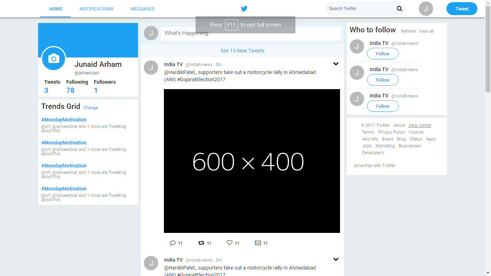

## HPDF Task 1 (ReactJS Front End)

<p align="center">
  
  
  
</p>

### To Do
**Create a twitter account to use as reference and use [Material UI](http://www.material-ui.com) to create a new ReactJS app with only the following pages:**
* [Twitter timeline](https://twitter.com)
* [Twitter Search Results](https://twitter.com/search?q=aadhaar)

### Frameworks and Plugins Used
* [React Material-UI](https://material-ui-next.com/)
* [Font Awesome](http://fontawesome.io/)
* [React Router](https://reacttraining.com/react-router/)

### Things Accomplished
* Created the UI using flex and Grid Layout of material-ui
* The App uses dynamic routing using react router to navigate between the timeline and the search query page.
* The event is observed when the search is made in the navbar after typing the search query and "Enter" is pressed mimicking the real time search (actually done by calling the function onKeyPress event)
* The search query is then passed to the search page component using the <Redirect> component of the React Router where the entered string and some dummy UI related to the search query are shown.
* Have also mimicked the show/hide of the 'new tweet' input in the center that accordingly gets expanded and shrinked onFocus and onBlur events.
* All of the above was accomplished using the class constructor that initializes the state of the props and further change it according to events
* Moreover the code is written in modular form with every element made in a dedicated component and then imported in the parent component. Thereby making the code management easier and efficient in future

###Directory Structure

```
task-1/
  README.md
  node_modules/
  package.json
  public/
    index.html
    favicon.ico
  src/
    assets/
        img/
            dume.png =>dummy image container for news feed
    Components/ => contains components related to the main page
    SearchComponents/ => contains components related to the Search page
    App.css
    App.js //
    App.test.js
    index.css
    index.js
    logo.svg
``` 
